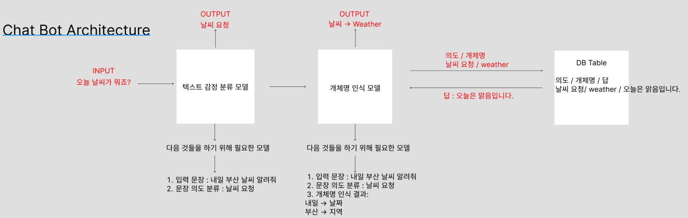

# Chatbot System Architecture

### 챗봇이란?
- 채터 + 로봇의 합성어로, 대화하는 로봇입니다.

### 어떤 분야의 챗봇이 있을 수 있는가?

- 시간, 장소 예약 챗봇

### 음식 주문을 도와주는 챗봇을 처음부터 제작하는 것이 목표입니다.

- 챗봇의 기본적인 기술은 인간의 언어를 기계가 이해하게 하는 것이 필요하다. 우린 이 기술을 "자연어 처리"라고 한다.
- 토큰 : 가장 기본이 되는 단어들을 말합니다.
  - 자연어 처리를 하기 위해서는 토큰 단위를 어떤 것으로 할지 정해야 합니다.
    1. 형태소를 토큰단위로 사용.
- 토크나이징 : 문장을 토큰으로 나누는 작업을 말한다.
- 임베딩 : 언어를 숫자나 벡터 형태로 변환하는 방법
  - 원 핫 인코딩
  - 분산 표현 방식(밀집 표현)
  - Word2Vec 모델 (신경망 임베딩 방식)
    - CBOW (continuous bag-of-words)   --> 오늘 __는 구름이 많아요 -> 주변 단어들로 빈칸을 예측하는 방식
    - Skip-gram  --> __ 날씨는 __이 많아요 -> 한 단어로 주변 단어들을 예측하는 방식
  - n-gram 유사도 (통계적 방식)
    - n-gram은 ->문장을 n-gram으로 나눈 토큰으로 유사도를 계산하는 것이다. 문장A와 문장B에서 동일한 토큰 / 문장 A 토큰 수
  - cos 유사도 (통계적 방식)
    - 벡터간의 거리나 각도를 이용해 유사성을 파악할 수 있다.
    - 벡터의 크기가 상관없을 때
- 텍스트 유사도
  - 사람은 두 문장이 비슷하다고 어떻게 인지할까? -> 임베딩을 통한 벡터 간의 거리를 계산하는 방법. -> 문장 역시 단어들의 집합이기 때문에 -> 하나의 벡터로 묶어서 문장 간의 유사도를 계산할 수 있다.
  - 
### 한국어 9품사의 종류와 의미

| 품사  | 설명                                  |
|-----|-------------------------------------|
| 명사  | 주로 물건이나 사람, 동식물을 가리킬 때 쓰는 품사        |
| 대명사 | 사람이나 사물의 이름을 대신해서 쓰는 품사             |
| 수사  | 숫자나 순서를 나타내는 품사                     |
| 동사  | 동작이나 작용을 나타내는 품사                    |
| 형용사 | 사물의 성질이나 상태를 나타내는 품사                |
| 관형사 | 체언 앞에서 체언을 수식하는 품사                  |
| 부사  | 동사, 형용사, 동사구, 문장 전체를 수식하는 역할을 맡은 품사 |
| 조사  | 명사, 부사 따위에 붙어 문법 관계를 맺어주는 품사        |
| 감탄사 | 감탄이나 놀람, 느낌, 응답을 나타내는 품사            |

